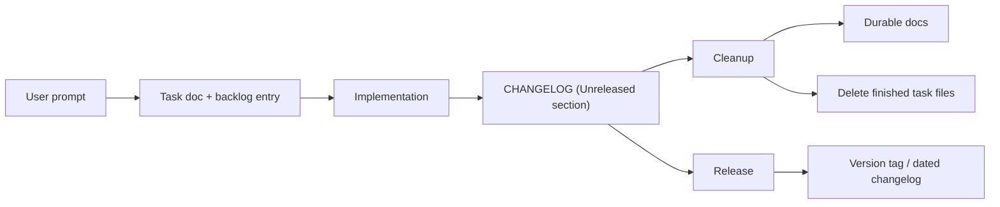
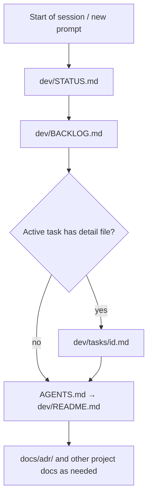
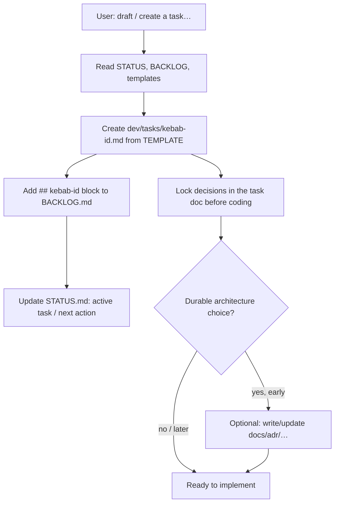
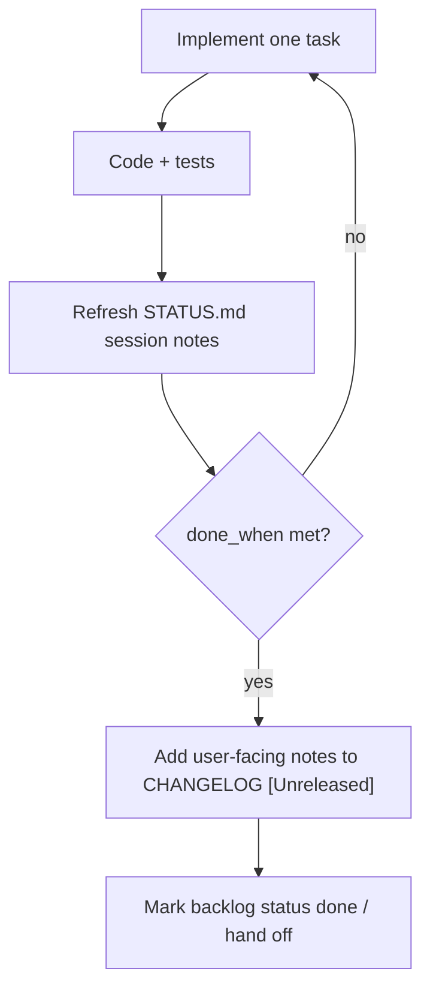
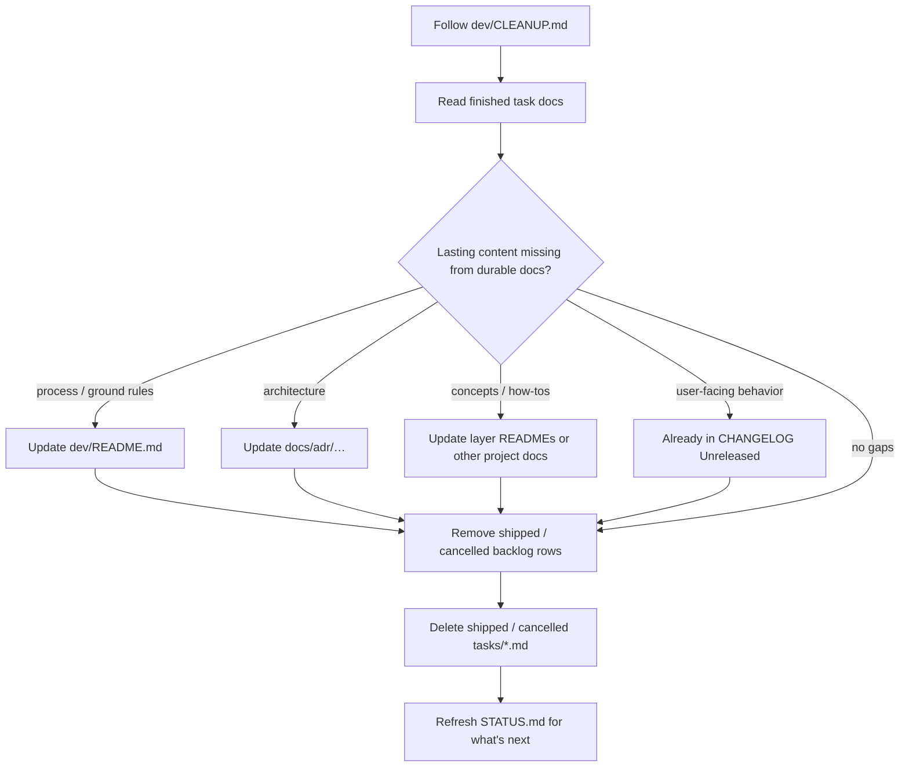

# md-harness

Markdown-native agent harness for solo monorepos.

Documentation + engineering-process layouts for a single-repo single-developer project.

Not a tool, not a skill, not a plugin. It's rather a skeleton for your repo that supports you if you are doing development with a coding agent. Instead of starting with an empty repo you start with md-harness.

## Install into an empty repo

Launch a coding agent or IDE of your choice (Cursor, VScode, Claude, Gemini etc.) in an empty dir and prompt it: 

> Install a simple md-harness from https://github.com/ruslanbes/md-harness

Or do it by hand: 

```sh
git clone https://github.com/ruslanbes/md-harness.git
cp -R md-harness/simple/. /path/to/new-repo/
rm -rf md-harness
cd /path/to/new-repo/
# launch your favorite editor with a coding agent: "cursor .", "code .", "idea ." etc.
```

## First agent prompts

```
This project will use md-harness, learn how to track tasks, document decisions and release the project. 
```

```
This project is: <describe your project and requirements>. Create a first task doc to setup a technology stack and project folder structure.
```

## What is the task doc?

It's a ticket plus a short design note you lock before coding.

Each task doc contains (usually):

- Problem statement
- List of decisions
- Implementation details
- "Done when" checklist

**List of decisions** is what you (a human) mainly want to read. You are the decision maker and only you are responsible for locking these decisions. Agent can suggest them, but your voice is final.

### Where do they live?

**Simple:** agents create `dev/tasks/<kebab-id>.md` from the task template, add a `## <task-id>` block to `BACKLOG.md`, and keep `STATUS.md` current. On cleanup, shipped behavior moves to `CHANGELOG.md` and task docs are deleted.

**Advanced:** same flow, but agents create `dev/tasks/<task-id>/` from `TEMPLATE/` (main file `task.md`), using `[tracker-id-]slug` IDs when a ticket exists. On cleanup, whole finished task folders are deleted after promoting durable content.

## Implementing a task

Read the task doc created by the agent, walk through the decisions and lock them (important!), check everything else in the task doc as much as you can. If you are satisfied, prompt the agent to implement the task and go drink a cup of whatever. Check the result. Rinse. Repeat.

## Layout (`simple/`)

```
simple/                   ← copy these files into a new repo root
  AGENTS.md               Agent entrypoint → dev/README.md
  CHANGELOG.md            Keep a Changelog ([Unreleased] + dated releases)
  .cursor/rules/
    workflow.mdc          Session workflow for Cursor agents
  docs/
    adr/
      README.md           When/how to write ADRs
      TEMPLATE.md         Copy → adr-NNN-short-title.md
  dev/                    How we run the project
    README.md             Setup, ground rules, doc index
    BACKLOG.md            Flat task index
    STATUS.md             Current focus / blockers / session notes
    CLEANUP.md            Promote durable content; remove finished tasks
    RELEASE.md            Promote Unreleased → version; tag
    tasks/
      README.md           Optional detail files (temporary)
      TEMPLATE.md         Copy → dev/tasks/<task-id>.md
```

## Layout (`advanced/` vs `simple/`)

Same tree as [`simple/`](simple/), except under `dev/tasks/`:

```
dev/tasks/
  README.md           Task folder conventions + ID rules
  TEMPLATE/
    task.md           Copy → dev/tasks/<task-id>/task.md
                      (other files in the task folder are optional, free-form)
```

Instead of a single `TEMPLATE.md` / `tasks/<id>.md`, each task is a folder with required `task.md`. Task IDs may use an optional external-tracker prefix. Cleanup deletes the whole task folder.

## Docs roles

| Kind | Location | Role |
|------|----------|------|
| Process | `dev/` | How we run the project: setup, ground rules, cleanup and release runbooks, plus living backlog/status and temporary task detail |
| Knowledge | `docs/` (ADRs), root `CHANGELOG.md`, layer READMEs and other project docs you add | Product and architecture knowledge that outlives any task |
| Session work | `dev/BACKLOG.md`, `dev/STATUS.md`, `dev/tasks/*` | Current work tracking; task artifacts are cleaned via CLEANUP.md |

## Development flow (`simple/`)

Rough path: **prompt → task doc → implementation → changelog → durable docs** (with cleanup on demand; release tags a version).

Paths below match **simple** (`dev/tasks/<id>.md`). In **advanced**, substitute `dev/tasks/<id>/task.md` and delete the whole task folder on cleanup.

### 1. End-to-end



### 2. What a session reads first

Cursor `workflow.mdc` steers the Cursor agent. Humans and other agents read `dev/README.md` and get the same idea.



### 3. Prompt → task doc



### 4. Implementation → changelog



While building, short-lived design stays in the task doc. Promote lasting decisions into ADRs, `dev/README.md`, or other project docs when they should outlive the task — often at cleanup, sometimes earlier.

### 5. Cleanup: promote, then delete



### 6. Release: version and tag

Follow `dev/RELEASE.md`: promote `[Unreleased]` → dated `[X.Y.Z]`, bump any other version sources, commit and tag.

Task detail files are temporary. After cleanup, shipped behavior lives in `CHANGELOG.md`; contracts and concepts live in ADRs, layer READMEs, other project docs, and process notes in `dev/README.md`.

## Variants

| | [`simple/`](simple/) | [`advanced/`](advanced/) |
|--|----------------------|--------------------------|
| **Role** | Minimal process + docs | Same core flow; richer task workspaces and optional external tracker IDs |
| **Task location** | Single file `dev/tasks/<id>.md` | Folder `dev/tasks/<id>/` with `task.md` plus any supporting files (free-form) |
| **Task ID** | kebab slug only | `[external-tracker-id-]kebab-slug` (local slug fine until a ticket exists) |
| **When to use** | Small solo projects; tasks fit in one doc | Heavier planning, analysis, championing, coordination; Jira/Linear/etc. |

Shared in both: `dev/` = how we run the project; `docs/` = durable product/architecture knowledge; cleanup removes finished task artifacts after promoting lasting content.

## Comparison

| Concern | Simple | Advanced |
|---------|--------|----------|
| Create task detail | Copy `tasks/TEMPLATE.md` → `tasks/<id>.md` | Copy `tasks/TEMPLATE/task.md` → `tasks/<id>/task.md` |
| Main task file | `dev/tasks/<id>.md` | `dev/tasks/<id>/task.md` |
| Extra material | Inline in the same file | Free-form files/folders next to `task.md` |
| Tracker link | Not modeled | Optional prefix on the task ID; rename when a ticket appears |
| Cleanup | Delete `tasks/<id>.md` | Delete whole `tasks/<id>/` folder |

## See also

- [FAQ](FAQ.md) — why use it at all and how this compares to Backlog.md, Spec Kit, and Beads

## License

[Apache License 2.0](LICENSE)
